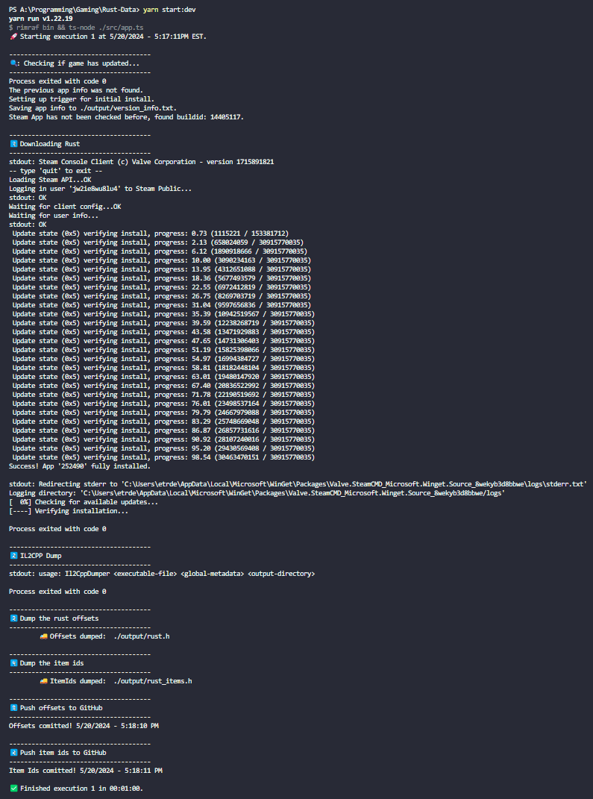
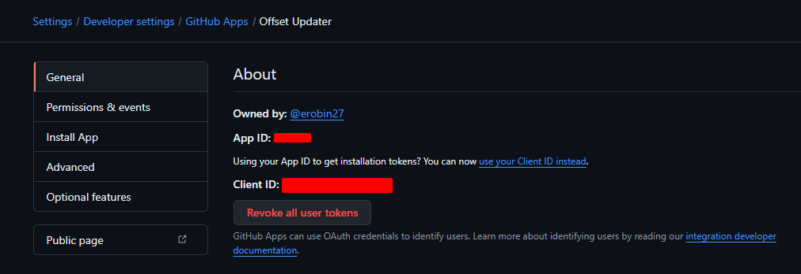
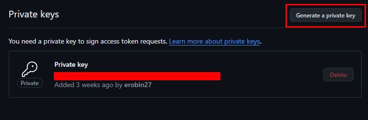

<!-- Improved compatibility of back to top link: See: https://github.com/othneildrew/Best-README-Template/pull/73 -->
<a name="readme-top"></a>
<!--
*** Thanks for checking out the Best-README-Template. If you have a suggestion
*** that would make this better, please fork the repo and create a pull request
*** or simply open an issue with the tag "enhancement".
*** Don't forget to give the project a star!
*** Thanks again! Now go create something AMAZING! :D
-->


<!-- PROJECT SHIELDS -->
<!--
*** I'm using markdown "reference style" links for readability.
*** Reference links are enclosed in brackets [ ] instead of parentheses ( ).
*** See the bottom of this document for the declaration of the reference variables
*** for contributors-url, forks-url, etc. This is an optional, concise syntax you may use.
*** https://www.markdownguide.org/basic-syntax/#reference-style-links
-->
[![Contributors][contributors-shield]][contributors-url]
[![Forks][forks-shield]][forks-url]
[![Stargazers][stars-shield]][stars-url]
[![Issues][issues-shield]][issues-url]
[![MIT License][license-shield]][license-url]
[![LinkedIn][linkedin-shield]][linkedin-url]


<!-- PROJECT LOGO -->
<br />
<div align="center">
  <a href="https://github.com/erobin27/Rust-Data">
    
  </a>

<h3 align="center">Rust-Data</h3>

  <p align="center">
    A TypeScript program that automatically checks the game Rust to see if its offsets have updated and dumps the game to find them.
    <br />
    <a href="https://github.com/erobin27/Rust-Data"><strong>Explore the docs »</strong></a>
    <br />
    <br />
    <a href="https://github.com/erobin27/Rust-Data">View Demo</a>
    ·
    <a href="https://github.com/erobin27/Rust-Data/issues/new?labels=bug&template=bug-report---.md">Report Bug</a>
    ·
    <a href="https://github.com/erobin27/Rust-Data/issues/new?labels=enhancement&template=feature-request---.md">Request Feature</a>
  </p>
</div>


<!-- TABLE OF CONTENTS -->
<details>
  <summary>Table of Contents</summary>
  <ol>
    <li>
      <a href="#about-the-project">About The Project</a>
      <ul>
        <li><a href="#built-with">Built With</a></li>
      </ul>
    </li>
    <li>
      <a href="#getting-started">Getting Started</a>
      <ul>
        <li><a href="#prerequisites">Prerequisites</a></li>
        <li><a href="#installation">Installation</a></li>
      </ul>
    </li>
    <li><a href="#usage">Usage</a></li>
    <li><a href="#roadmap">Roadmap</a></li>
    <li><a href="#contributing">Contributing</a></li>
    <li><a href="#license">License</a></li>
    <li><a href="#contact">Contact</a></li>
    <li><a href="#acknowledgments">Acknowledgments</a></li>
  </ol>
</details>


<!-- ABOUT THE PROJECT -->
## Preview



## About The Project

Rust-Data is a tool designed to monitor and extract data from the game Rust. It checks for updates to the game's offsets and dumps the game to find the latest offsets. This can be particularly useful for developing hacks for the game and removing the manual process of updating offsets.

<p align="right">(<a href="#readme-top">back to top</a>)</p>


### Built With

* [TypeScript]()
* [Node.js]()
* [SteamCMD]()
* [IL2CPP]()
* [Yarn]()

<p align="right">(<a href="#readme-top">back to top</a>)</p>


<!-- GETTING STARTED -->
## Getting Started

To get a local copy up and running follow these steps.

### Installation

1. Install node and yarn
2. Download IL2CPP from github [releases](https://github.com/Perfare/Il2CppDumper/releases/tag/v6.7.40) 
3. Add the contents to a folder, I suggest saving to `/programs/il2cpp`.
4. Install SteamCMD CLI
    ```sh
    winget install Valve.SteamCMD
    ```
5. Clone the repo
   ```sh
   git clone https://github.com/erobin27/Rust-Data.git
   ```
6. Install yarn packages
   ```sh
   yarn install
   ```
7. Add you .pem for github, I suggest saving to `/programs`
8. Setup your .env file, this will include all secret variables and paths to things like il2cpp, output, .pem, etc.
    ```bash
    #Example .env File
    DUMP_CS_PATH='./programs/il2cpp/dump.cs'
    HEADER_OUTPUT='output/rust.h'

    GITHUB_APP_ID='8897852'
    GITHUB_CLIENT_ID='Iv1.1d37sdf6s485'
    GITHUB_CLIENT_SECRET='abcs310sfse356687546ds7sdda1'
    GITHUB_INSTALLATION_ID='46575654'
    GITHUB_PEM_PATH='./programs/my-pem.private-key.pem'

    STEAM_USERNAME='steam-name-here'
    STEAM_PW='steam-pw-here'

    # App Settings
    MINUTES_BETWEEN_CHECKS='5'
    TARGET_GH_USERNAME='erobin27'
    TARGET_GH_PROJECT='Rust-DMA'
    OFFSET_FILE_PATH='SDK/rust.h'               # Full path: Rust-DMA/SDK/rust.h
    ITEM_IDS_FILE_PATH='SDK/rust_items.h'       # Full path: Rust-DMA/SDK/rust_items.h
    ```

<p align="right">(<a href="#readme-top">back to top</a>)</p>


### GitHub App Setup

If you need to integrate the app to update your github files you can do the following
1. Navigate to the app page [https://github.com/settings/apps/offset-updater](https://github.com/settings/apps/offset-updater)
2. Grab the App ID and Client ID



3. Generate your secret and store it


4. Generate your private key (.pem) it will download a file for you



5. Find your installation id, idk where you get that.

6. Save all of the data you've gathered in your .env

<p align="right">(<a href="#readme-top">back to top</a>)</p>


<!-- USAGE EXAMPLES -->
## Usage

1. setup your .env accordingly
2. run `yarn install`
3. run `yarn start:dev` and the offsets will be dumped every 5 minutes
4. you should have files created like this, if so you have setup everything correctly


<p align="right">(<a href="#readme-top">back to top</a>)</p>


<!-- ROADMAP -->
## Roadmap

- [ ] Setup a frontend

See the [open issues](https://github.com/erobin27/Rust-Data/issues) for a full list of proposed features (and known issues).

<p align="right">(<a href="#readme-top">back to top</a>)</p>


<!-- LICENSE -->
## License

Distributed under the MIT License.

<p align="right">(<a href="#readme-top">back to top</a>)</p>


<!-- CONTACT -->
## Contact

idgnfs - [@idgnfs](https://twitter.com/idgnfs)

Project Link: [https://github.com/erobin27/Rust-Data](https://github.com/erobin27/Rust-Data)

<p align="right">(<a href="#readme-top">back to top</a>)</p>


<!-- ACKNOWLEDGMENTS -->
## Acknowledgments

* Based on RustBlazeDumper by [Akandesh](https://github.com/Akandesh/BlazeDumper-Rust)
* Utilizes [Il2CppDumper](https://github.com/Perfare/Il2CppDumper) for dumping unity games

<p align="right">(<a href="#readme-top">back to top</a>)</p>


<!-- MARKDOWN LINKS & IMAGES -->
<!-- https://www.markdownguide.org/basic-syntax/#reference-style-links -->
[contributors-shield]: https://img.shields.io/github/contributors/erobin27/Rust-Data.svg?style=for-the-badge
[contributors-url]: https://github.com/erobin27/Rust-Data/graphs/contributors
[forks-shield]: https://img.shields.io/github/forks/erobin27/Rust-Data.svg?style=for-the-badge
[forks-url]: https://github.com/erobin27/Rust-Data/network/members
[stars-shield]: https://img.shields.io/github/stars/erobin27/Rust-Data.svg?style=for-the-badge
[stars-url]: https://github.com/erobin27/Rust-Data/stargazers
[issues-shield]: https://img.shields.io/github/issues/erobin27/Rust-Data.svg?style=for-the-badge
[issues-url]: https://github.com/erobin27/Rust-Data/issues
[license-shield]: https://img.shields.io/github/license/erobin27/Rust-Data.svg?style=for-the-badge
[license-url]: https://github.com/erobin27/Rust-Data/blob/master/LICENSE.txt
[linkedin-shield]: https://img.shields.io/badge/-LinkedIn-black.svg?style=for-the-badge&logo=linkedin&colorB=555
[linkedin-url]: https://linkedin.com/in/linkedin_username
[product-screenshot]: images/screenshot.png
[Next.js]: https://img.shields.io/badge/next.js-000000?style=for-the-badge&logo=nextdotjs&logoColor=white
[Next-url]: https://nextjs.org/
[React.js]: https://img.shields.io/badge/React-20232A?style=for-the-badge&logo=react&logoColor=61DAFB
[React-url]: https://reactjs.org/
[Vue.js]: https://img.shields.io/badge/Vue.js-35495E?style=for-the-badge&logo=vuedotjs&logoColor=4FC08D
[Vue-url]: https://vuejs.org/
[Angular.io]: https://img.shields.io/badge/Angular-DD0031?style=for-the-badge&logo=angular&logoColor=white
[Angular-url]: https://angular.io/
[Svelte.dev]: https://img.shields.io/badge/Svelte-4A4A55?style=for-the-badge&logo=svelte&logoColor=FF3E00
[Svelte-url]: https://svelte.dev/
[Laravel.com]: https://img.shields.io/badge/Laravel-FF2D20?style=for-the-badge&logo=laravel&logoColor=white
[Laravel-url]: https://laravel.com
[Bootstrap.com]: https://img.shields.io/badge/Bootstrap-563D7C?style=for-the-badge&logo=bootstrap&logoColor=white
[Bootstrap-url]: https://getbootstrap.com
[JQuery.com]: https://img.shields.io/badge/jQuery-0769AD?style=for-the-badge&logo=jquery&logoColor=white
[JQuery-url]: https://jquery.com 